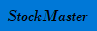
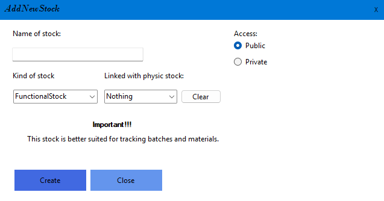
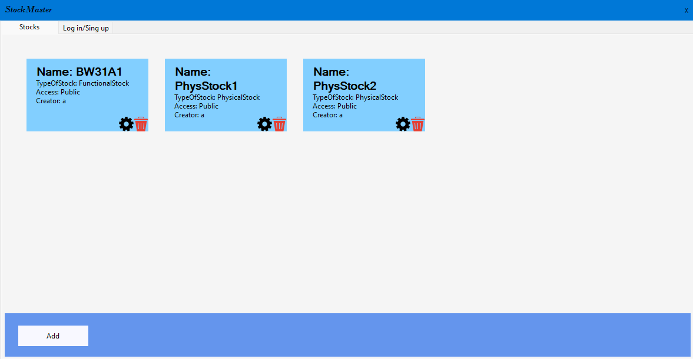
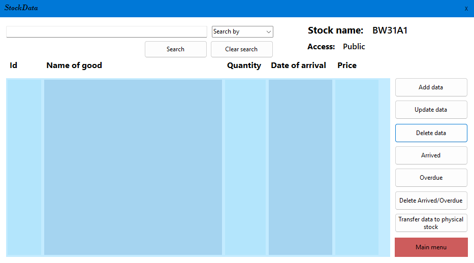
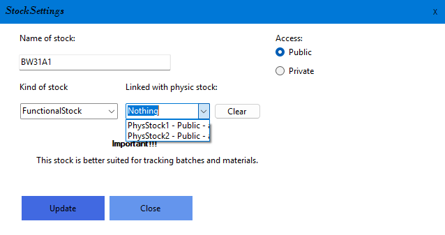
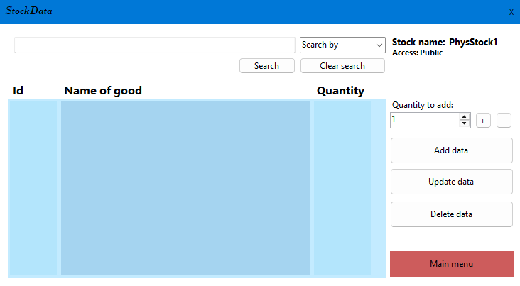

# StockMaster

  
   
  <b>Professional Inventory Management and Stock Operations System</b>

  
  
  
  

---

## Overview
**StockMaster** is a Windows desktop application designed to automate warehouse accounting. It allows you to track incoming goods, manage stock balances, and ensures data security using access identifiers.

## Tech Stack
| Technology | Version | Description |
| :--- | :--- | :--- |
| **[.NET](https://dotnet.microsoft.com/)** | `9.0` | Main development platform (WinForms) |
| **[EF Core](https://learn.microsoft.com/en-us/ef/core/)** | `9.0.14` | Object-Relational Mapping (ORM) |
| **[SQLite](https://www.sqlite.org/)** | `3.x` | Lightweight embedded database |
| **[FuzzySharp](https://github.com/JakeGinnivan/FuzzySharp)** | `2.0.2` | Fuzzy search algorithms for smart filtering |

---

## Installation
1. Go to the [**Releases**](../../releases) section.
2. Download the `StockMaster.zip` archive.
3. Extract the archive to a convenient location.
4. Run the `StockMaster.exe` file.

---

## Usage

### 1. Getting Started
Upon first launch, you need to sign up. All data is stored locally in your personal database file.

### 2. Creating a Stock
Click the **Add** button to create a new stock. You can choose between two stock types:
-   **Functional Stock:** Designed for tracking expected arrivals and logistics.
-   **Physical Stock:** Designed for actual inventory management and on-hand balances.

>**Tip:** If you select the "Private" access type, the stock will be password-protected.

### 3. Managing Stocks
On the main page, you will see cards for your created stocks. You can update their settings or delete them using the corresponding buttons.

---

## Stock Types in Detail

### Functional Stock
This mode focuses on arrival logistics.
*   **Statuses:** Mark items as `Arrived` or `Overdue`.
*   **Linking:** You can automatically transfer data to a Physical Stock once an arrival is confirmed.
*   **Search:** Use the intelligent fuzzy search at the top of the table to find items quickly.

*Stock Linking:*

### Physical Stock
This mode is for actual control of items on the shelves.
*   **Quick Actions:** Instantly increase or decrease item quantities using the `Add` / `Subtract` buttons.
*   **Sorting:** Click on any column header to sort the data instantly.

